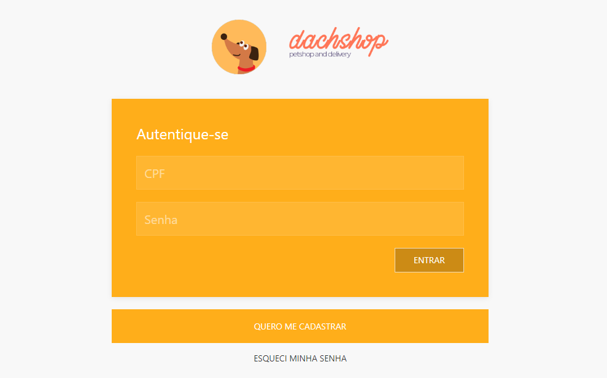

# Ecommerce_Front_Petshop
 Construção de uma página utilizando o uikit personalizado para um pesthop

 # Tecnologias utilizadas
- Node.js 
- Npm
- Yarn 
- UiKit
- Angular 
- Mockoon 
- Visual Studio Code (Versão mais recente disponível)

# Objetivo do Projeto
Criar um Frontend para uma Petshop com: 
- vitrine de produtos
- cadastro de produtos
- carrinho de compras
- área logada e área pública
- autenticação 
- construção de componentes mais avançados, com dependências externas e implementação de comunicação com uma API externa (mockada).
